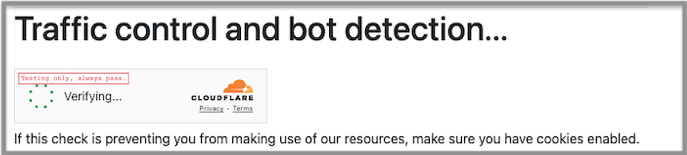

# BotChallengePage

[](https://github.com/samvera-labs/bot_challenge_page/actions/workflows/ci.yml) [](http://badge.fury.io/rb/bot_challenge_page)

BotChallengePage lets you protect certain routes in your Rails app with [CloudFlare Turnstile](https://www.cloudflare.com/application-services/products/turnstile/) "CAPTHCA alternate" bot detector. Rather than the typical form submission use case for Turnstile, the user will be redirected to an interstitial challenge page, and automatically redirected back immediately on success.

The motivating use case is fairly dumb (probably AI-related) crawlers, rather than targetted attacks, although we have tried to pay attention to security.  Many of our use cases were crawlers getting caught following every combination of voluminous facet values in search results in a near "infinite space", and causing us resource usage issues.



* You can optionally configure a rate limit that is allowed BEFORE the challenge is triggered
  * Uses rack-attack to track rate, requires `Rails.cache` or `Rack::Attack.cache.store` to be set to a persistent shared high-performance cache, probably redis or memcached.

* Once a challenge is passed, the pass is stored in a cookie, and a challenge won't be redisplayed for a configurable amount of time, so long as cookie is present

* **Note:** User-agent does always need both cookies and javascript enabled to be able to pass challenge and get through!


## Installation and Configuration

* Get a [CloudFlare account and Turnstile widget set up](https://www.cloudflare.com/application-services/products/turnstile/), which should give you a turnstile `sitekey` and `secret_key` you will need later in configuration.

* `bundle add bot_challenge_page`, `bundle install`

* Run the installer
  * if you want to use rack-attack for some permissive pre-challenge rate, `rails g bot_challenge_page:install`

  * If you do not want to use rack-attack and want challenge on FIRST request, `rails g bot_challenge_page:install --no-rack-attack`

  * By default challenge pages are "inline" at protected URL. To redirect to a separate challenge page URL instead, `--redirect-for-challenge`

* If you are **not using rack-attack**, you need to add a before_action to the controller(s)
  you'd like to protect, eg:

        before_action only: :index do |controller|
          BotChallengePage::BotChallengePageController.bot_challenge_enforce_filter(controller, immediate: true)
        end


* Configure in the generated `./config/initializers/bot_challenge_page.rb`
  * At a minimum you need to configure your Cloudflare Turnstile keys, and some paths to protect!
    * Note that we can only protect GET paths, and also think about making sure you DON'T protect
      any path your front-end needs JS `fetch` access to, as this would block it (at least
      without custom front-end code we haven't really explored)

    * If you are tempted to just protect `/` that may work, but worth thinking about any hearbeat paths, front-end requestable paths, or other machine-access-desired paths.

  * Some other configuration options are offered -- more advanced/specialized ones are available that are not mentioned in generated config file, see [Config class](./app/models/bot_challenge_page/config.rb)


## Customize challenge page display

Some of the default challenge page html uses bootstrap alert classes. You may want to provide custom CSS if you aren't using bootstrap. You can see the default challenge page html at [challenge.html.erb](./app/views/bot_challenge_page/bot_challenge_page/challenge.html.erb). You may wish to CSS-style other parts too!

You can customize all text via I18n, see keys in [bot_challenge_page.en.yml](./config/locales/bot_challenge_page.en.yml)

The challenge page by default will be displayed in your app's default rails `layout`.

To customize the layout or challenge page HTML more further, you can use configuration to supply a `render` method for the controller pointing to your own templates or other layouts. You will probably want to re-use the partials we use in our default template, for standard functionality. And you'll want to provide `<template>` elements with the same id's for those elements, but can put whatever you want inside the templates!

```ruby
BotChallengePage::BotChallengePageController.bot_challenge_config.challenge_renderer = ()->  {
  render "my_local_view_folder/whatever", layout "another_layout"
}
```

## Logging

By default we log when a challenge result is submitted to the back-end; you can find challenge passes or failures by searching your logs for `BotChallengePage`.

We do not log when a challenge is issued -- experience shows challenge issues far outnumber challenge results, and can fill up the logs too fast.

If you'd like to log or observe challenge issues, you can configure a proc that is executed
in the context of the controller, and is called when a page is blocked by a challenge.

```ruby
BotChallengePage::BotChallengePageController.bot_challenge_config.after_challenge = (_bot_challenge_class)->  {
  logger.info("page blocked by challenge: #{request.uri}")
}
```

Or, here's how I managed to get it in [lograge](https://github.com/roidrage/lograge), so a page blocked results in a `bot_chlng=true` param in a lograge line.

```ruby
BotChallengePage::BotChallengePageController.bot_challenge_config.after_challenge =
  ->(bot_detect_class) {
    request.env["bot_detect.blocked_for_challenge"] = true
  }


# production.rb
config.lograge.custom_payload do |controller|
  {
    bot_chlng: controller.request.env["bot_detect.blocked_for_challenge"]
  }.compact
end
```

## Example possible Blacklight config

Many of us in my professional community use [blacklight](https://github.com/projectblacklight/blacklight).  Here's a possible sample blacklight config to:

* Protect default catalog controller, including search results and any other actions
* But give the user 3 free searches in a 36 hour period before challenged
* For the #facet action used for "facet… more" links --  exempt from protection if the request is being made by a browser JS `fetch`, we just let those through. (Which means a determined attacker could do that on purpose, not defense against on purpose DDoS)

```ruby
Rails.application.config.to_prepare do
  BotChallengePage::BotChallengePageController.bot_challenge_config.enabled = true

  # Get from CloudFlare Turnstile: https://www.cloudflare.com/application-services/products/turnstile/
  BotChallengePage::BotChallengePageController.bot_challenge_config.cf_turnstile_sitekey = "MUST GET"
  BotChallengePage::BotChallengePageController.bot_challenge_config.cf_turnstile_secret_key = "MUST GET"

  BotChallengePage::BotChallengePageController.bot_challenge_config.rate_limited_locations = [
    "/catalog"
  ]

  # allow rate_limit_count requests in rate_limit_period, before issuing challenge
  BotChallengePage::BotChallengePageController.bot_challenge_config.rate_limit_period = 36.hour
  BotChallengePage::BotChallengePageController.bot_challenge_config.rate_limit_count = 3

  BotChallengePage::BotChallengePageController.allow_exempt = ->(controller) {
    # Excempt any Catalog #facet action that looks like an ajax/fetch request, the redirect
    # ain't gonna work there, we just exempt it.
    #
    # sec-fetch-dest is set to 'empty' by browser on fetch requests, to limit us further;
    # sure an attacker could fake it, we don't mind if someone determined can avoid
    # bot challenge on this one action
    ( controller.params[:action] == "facet" &&
      controller.request.headers["sec-fetch-dest"] == "empty" &&
      controller.kind_of?(CatalogController)
    )
  }

  BotChallengePage::BotChallengePageController.rack_attack_init
end

```

## Development and automated testing

All logic and config hangs off a controller, with the idea that you could sub-class the controller to override any functionality -- or even have multiple sub-classes in your app with different configuration or customized config. But this hasn't really been tested/fleshed out yet.

Run tests with `bundle exec rspec`.

We test with a checked-into-repo dummy app at `./spec/dummy`, and use [Appraisal](https://github.com/thoughtbot/appraisal) to test under different rails versions.

Locally one way to test with a specific rails version appraisal is `bundle exec appraisal rails-7.2 rspec`

If you make any changes to `Gemfile` you may need to run `bundle exec appraisal install` and commit changes.

**One reason tests are slow** is I think we're running system tests with real turnstile proof-of-work bot detection JS code? (Or is it, when we are are using a CF turnstile testing key that always passes?).  There aren't many tests so it's no big deal, but this is something that could be investigated/optmized more potentially.

## Possible future features?

* allow regex in default location_matcher? Easy to do if you want it, just say so.

* We could support swap-in Turnstile-alternatives, like [hCAPTHCA](https://www.hcaptcha.com/), [Google reCAPTCHA v3](https://developers.google.com/recaptcha/docs/v3), or even open source proof of work implementations like [ALTCHA](https://altcha.org/docs/get-started/), [pow-bot-deterrent](https://github.com/sequentialread/pow-bot-deterrent), or [Friendly Captcha](https://github.com/FriendlyCaptcha/friendly-captcha-sdk).  But the (free) cost/benefit of Turnstile are pretty good, so I don't myself have a lot of motivation to add this complexity.

* Something to make it easier to switch the challenge on only based on signals that server/app is under some defined heavy load?


## License
The gem is available as open source under the terms of the [MIT License](https://opensource.org/licenses/MIT).

## See also/Acknowledgements

* [Joe Corral's blog post](https://lehigh-university-libraries.github.io/blog/turnstile.html) about using this approach at Lehigh University Libraries with an islandora/drupal app.

* Joe's [similar plugin for drupal](https://drupal.org/project/turnstile_protect)

* [Similar feature built into PHP VuFind app](https://github.com/vufind-org/vufind/pull/4079)

* [My own blog post about this approach](https://bibwild.wordpress.com/2025/01/16/using-cloudflare-turnstile-to-protect-certain-pages-on-a-rails-app/).

* Wow only after I developed all this did I notice [rails-cloudflare-turnstile](https://github.com/instrumentl/rails-cloudflare-turnstile) which implements some pieces that could have been re-used here, but I feel good becuase we wanted these weird features. But if you want a much simpler more straightforward Turnstile implementation for more standard use cases or your own different use cases, I'd go here.

* And yet another implementation in Rails that perhaps makes more assumptions about use cases, [turnstile-captcha](https://github.com/pfeiffer/turnstile-captcha). Haven't looked at it much.


